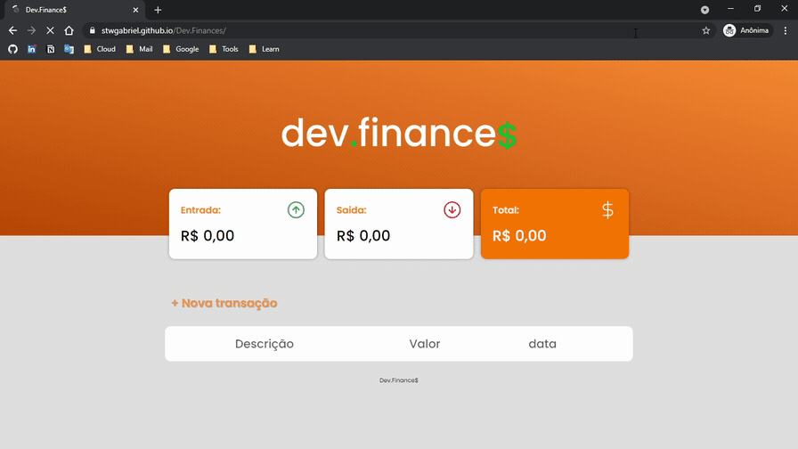

# Dev.Finance$

veja o app em ação: https://stwgabriel.github.io/dev.finances/

## Descrição
O Dev Finances é uma aplicaçao de gestao de finanças.

## O projeto

Foi usado HTML e CSS para desenvolver a interface e animações e Javascript para as interações com LocalStorage para salvar os dados no browser.

### linguagens e ferramentas utilizadas

   
   
   
   

### Social & Profissional

   
   
   
   
   

[Link Tree](https://cutt.ly/stwgabriel)
